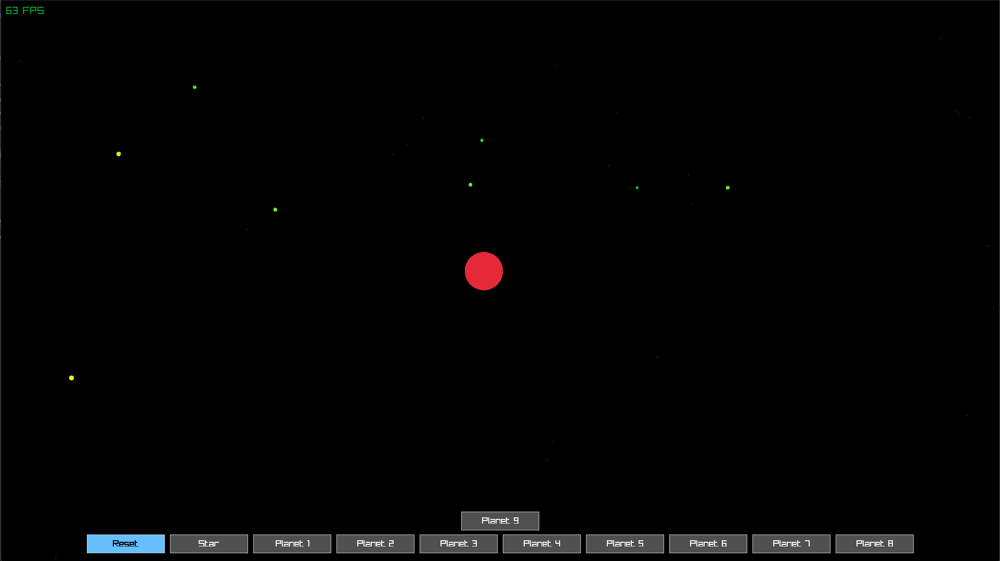

# nbody-odin

A simple n-body simulation written in Odin.

## Features

- Generates a random solar system with a star, planets, and asteroid belts
- Simulates gravity and orbital mechanics
- Visualizes the system using raylib
- Removes bodies that collide with the star or stray too far away
- Automatic camera tracking of the system and zooming

## Performance

The simulation can be toggled between calculating gravity from all bodies (n-body) or just from the star for better performance. The n-body calculation can be computationally expensive, especially as the number of bodies increases, so use it with caution.

## License

This project is licensed under the MIT License. See the LICENSE file for details.
